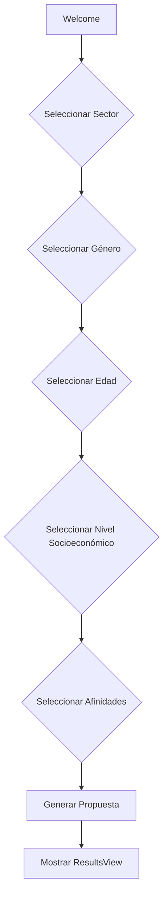

# Documentación Técnica - Agente IA Claro Media

## Arquitectura del Proyecto

### Estructura de Carpetas

```
src/
├── components/          # Componentes reutilizables de React
│   ├── ChatAgent.jsx    # Componente principal del chat conversacional
│   ├── ChatMessage.jsx  # Componente individual de mensaje
│   ├── ChatOptions.jsx  # Botones de opciones interactivas
│   ├── ResultsView.jsx  # Vista de resultados y propuesta estratégica
│   ├── Loader.jsx       # Componente de carga
│   └── ErrorBoundary.jsx # Manejo de errores de React
├── data/                # Datos y lógica de negocio
│   └── mockData.js      # Datos mock y funciones de generación
├── services/            # Servicios externos (APIs)
│   └── apiService.js    # Servicio de ChatGPT API (preparado)
├── App.jsx              # Componente raíz de la aplicación
├── main.jsx             # Punto de entrada de React
└── index.css            # Estilos globales
```

## Flujo de la Aplicación

### 1. Inicialización

```
main.jsx → App.jsx → ChatAgent.jsx
```

- `main.jsx`: Monta la aplicación React con ErrorBoundary
- `App.jsx`: Renderiza el layout principal y maneja el state de la propuesta
- `ChatAgent.jsx`: Inicia el flujo conversacional

### 2. Flujo Conversacional



#### Estados del Chat

1. **welcome**: Mensaje inicial del agente
2. **sector**: Usuario selecciona su sector de negocio
3. **genero**: Usuario define género de la audiencia
4. **edad**: Usuario selecciona rango de edad
5. **nivelSocioeconomico**: Usuario define nivel socioeconómico
6. **afinidades**: Usuario selecciona múltiples afinidades (multiselect)

### 3. Generación de Propuesta

Cuando el usuario completa todos los pasos:

```javascript
userData = {
  sector: "Tecnología",
  genero: "Todos",
  edad: "25 a 34",
  nivelSocioeconomico: "Alto (E5-E6)",
  afinidades: ["Educación en línea", "E-Commerce", "Criptomonedas"]
}

↓

generarPropuestaEstrategica(userData)

↓

propuesta = {
  sector,
  audiencia: { genero, edad, nivelSocioeconomico },
  afinidades,
  insights: [...],
  recomendaciones: [...],
  proximosPasos: [...]
}
```

## Componentes Principales

### ChatAgent.jsx

**Responsabilidad**: Orquestar el flujo conversacional

**State Management**:

- `messages`: Array de mensajes del chat
- `currentStep`: Paso actual del flujo
- `userData`: Datos recopilados del usuario
- `isTyping`: Estado de escritura del agente
- `showOptions`: Mostrar/ocultar botones de opciones
- `selectedAfinidades`: Afinidades seleccionadas en multiselect

**Funciones clave**:

- `addAgentMessage()`: Añade mensaje del agente con efecto typing
- `addUserMessage()`: Añade mensaje del usuario
- `handleSectorSelect()`, `handleGeneroSelect()`, etc.: Manejan cada paso
- `getCurrentOptions()`: Retorna opciones según el paso actual

### ChatMessage.jsx

**Props**:

- `message`: Texto del mensaje
- `isUser`: Boolean, true si es mensaje del usuario
- `isTyping`: Boolean, muestra animación de escritura

**Estilos**:

- Usuario: Fondo rojo (claro-red), alineado a la derecha
- Agente: Fondo glassmorphism, alineado a la izquierda

### ChatOptions.jsx

**Props**:

- `options`: Array de opciones disponibles
- `onSelect`: Callback cuando se selecciona una opción
- `multiSelect`: Boolean, permite selección múltiple
- `selectedOptions`: Array de opciones ya seleccionadas

**Comportamiento**:

- Single select: Selección inmediata, avanza automáticamente
- Multi select: Permite seleccionar múltiples, muestra botón "Continuar"

### ResultsView.jsx

**Props**:

- `propuesta`: Objeto con la propuesta generada
- `onReset`: Callback para reiniciar el flujo

**Secciones**:

1. Header con sector
2. Perfil de Audiencia (grid 3 columnas)
3. Afinidades Identificadas (tags)
4. Insights Clave (cards con animación escalonada)
5. Recomendaciones Estratégicas (lista numerada)
6. Próximos Pasos (grid 2 columnas)
7. Botón para crear nueva propuesta

## Datos y Lógica de Negocio

### mockData.js

**Exports**:

- `SECTORES`: Array de sectores disponibles
- `GENEROS`: Array de géneros
- `RANGOS_EDAD`: Array de rangos de edad
- `NIVELES_SOCIOECONOMICOS`: Array de niveles socioeconómicos
- `AFINIDADES_POR_SECTOR`: Object mapping sector → array de afinidades
- `RUTA_COMPORTAMIENTO`: Array con fases del journey
- `INSIGHTS_POR_SECTOR`: Object mapping sector → array de insights
- `generarPropuestaEstrategica()`: Función que genera la propuesta

**Función generarPropuestaEstrategica**:

```javascript
generarPropuestaEstrategica(userData) {
  // 1. Extrae datos del usuario
  // 2. Obtiene insights del sector
  // 3. Obtiene afinidades del sector
  // 4. Genera recomendaciones genéricas
  // 5. Genera próximos pasos
  // 6. Retorna objeto propuesta estructurado
}
```

## Estilos y Diseño

### Sistema de Colores

```javascript
colors: {
  claro: {
    red: '#E30613',    // Rojo corporativo de Claro
    dark: '#1a1a1a',   // Negro para fondos
    gray: '#2d2d2d',   // Gris para elementos
  }
}
```

### Técnicas de Diseño

1. **Glassmorphism**: `bg-white/10 backdrop-blur-md`
2. **Degradados**: `bg-gradient-to-br from-black/80`
3. **Bordes translúcidos**: `border border-white/20`
4. **Sombras**: `shadow-2xl`, `shadow-claro-red/50`

### Animaciones Personalizadas

```javascript
animations: {
  'fade-in': 'fadeIn 0.5s ease-in',
  'slide-up': 'slideUp 0.5s ease-out',
  'pulse-soft': 'pulseSoft 2s ease-in-out infinite',
}
```

## State Management

Actualmente usa React State local. Para escalar:

### Opción 1: Context API

```javascript
// contexts/ChatContext.jsx
export const ChatContext = createContext();

export const ChatProvider = ({ children }) => {
  const [userData, setUserData] = useState({});
  const [messages, setMessages] = useState([]);
  // ...
  return (
    <ChatContext.Provider value={{ userData, messages, ... }}>
      {children}
    </ChatContext.Provider>
  );
};
```

### Opción 2: Zustand (recomendado para escalar)

```javascript
// store/chatStore.js
import create from 'zustand';

export const useChatStore = create((set) => ({
  userData: {},
  messages: [],
  currentStep: 'welcome',
  setUserData: (data) => set({ userData: data }),
  addMessage: (message) => set((state) => ({
    messages: [...state.messages, message]
  })),
  // ...
}));
```

## Performance

### Optimizaciones Implementadas

1. **Animaciones CSS**: Usa transforms en lugar de position/size
2. **Lazy rendering**: Componentes se renderizan solo cuando son visibles
3. **Memoización**: Considerar React.memo para componentes pesados

### Optimizaciones Pendientes

1. **Code Splitting**:

```javascript
const ResultsView = React.lazy(() => import('./components/ResultsView'));
```

2. **Virtualización**: Para listas largas de mensajes
3. **Image Optimization**: Usar WebP, lazy loading

## Testing

### Estructura de Tests (a implementar)

```
tests/
├── unit/
│   ├── components/
│   │   ├── ChatMessage.test.jsx
│   │   ├── ChatOptions.test.jsx
│   │   └── ResultsView.test.jsx
│   └── data/
│       └── mockData.test.js
├── integration/
│   └── ChatAgent.test.jsx
└── e2e/
    └── full-flow.spec.js
```

### Ejemplo de Test

```javascript
import { render, screen, fireEvent } from '@testing-library/react';
import ChatOptions from '../components/ChatOptions';

test('renders options correctly', () => {
  const options = ['Option 1', 'Option 2'];
  const handleSelect = jest.fn();

  render(<ChatOptions options={options} onSelect={handleSelect} />);

  expect(screen.getByText('Option 1')).toBeInTheDocument();
  expect(screen.getByText('Option 2')).toBeInTheDocument();
});

test('calls onSelect when option is clicked', () => {
  const options = ['Option 1'];
  const handleSelect = jest.fn();

  render(<ChatOptions options={options} onSelect={handleSelect} />);

  fireEvent.click(screen.getByText('Option 1'));

  expect(handleSelect).toHaveBeenCalledWith('Option 1');
});
```

## Deployment

### Build de Producción

```bash
npm run build
```

Genera carpeta `dist/` con assets optimizados.

### Despliegue

#### Vercel (Recomendado)

```bash
npm install -g vercel
vercel
```

#### Netlify

```bash
npm install -g netlify-cli
netlify deploy --prod
```

#### GitHub Pages

```javascript
// vite.config.js
export default defineConfig({
  base: '/chatgpt-claro-media/',
  // ...
});
```

```bash
npm run build
npm install -g gh-pages
gh-pages -d dist
```

## Variables de Entorno

Para producción, configurar:

```env
VITE_OPENAI_API_KEY=sk-xxx
VITE_OPENAI_MODEL=gpt-4
VITE_API_ENDPOINT=https://api.tu-backend.com
```

## Troubleshooting

### Error: Module not found

- Verificar imports relativos correctos
- Reinstalar node_modules: `rm -rf node_modules && npm install`

### Estilos no se aplican

- Verificar que Tailwind está configurado correctamente
- Revisar `tailwind.config.js` content paths
- Limpiar cache: `rm -rf .vite`

### Animaciones no funcionan

- Verificar que las keyframes están en `tailwind.config.js`
- Comprobar que las clases de animación se aplican correctamente

### Background no se muestra

- Verificar que `Fondo.jpeg` está en `/public`
- Revisar path en App.jsx: `url(/Fondo.jpeg)`
- En producción, ajustar base path si es necesario

## Recursos Adicionales

- [React Docs](https://react.dev)
- [Tailwind CSS](https://tailwindcss.com)
- [Vite Guide](https://vitejs.dev/guide/)
- [OpenAI API](https://platform.openai.com/docs)
